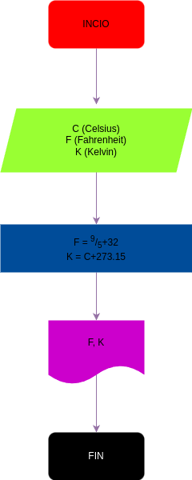

# Programa 1: temperature_convertor
Programam en Phython para Convertir temperatura en grados Celsius a Fahrenheit y Kelvin

# Análisis

### Variables de entrada
- C: Celcius

### Procesamiento
- F: Fahrenheit
- K: Kelvin

$ F=(9/5*C)+32$
$ K=C+273.15 $

## Diseño

## Construccion

- Codigo implementado en el archivo "temperature_convertor.py"
